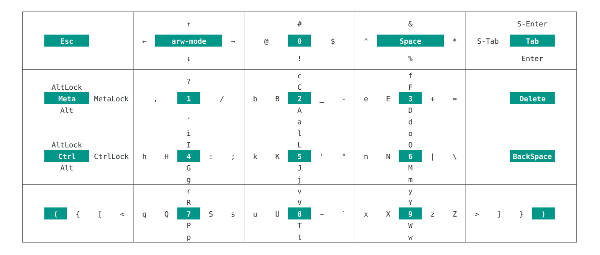
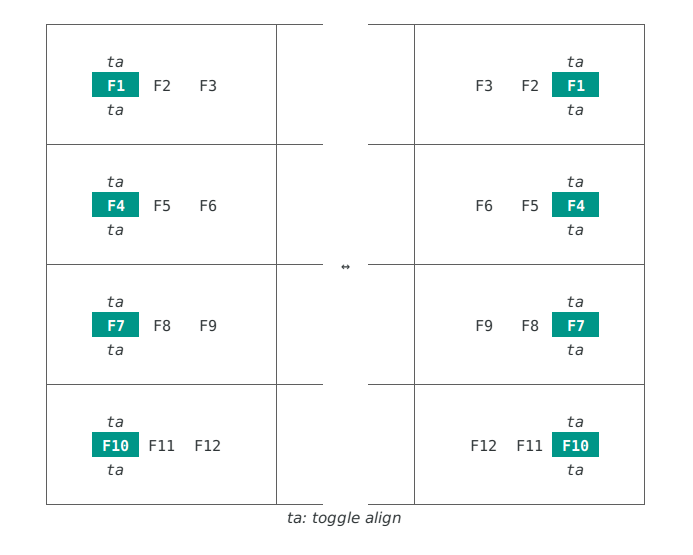

QuickFlickの日本語版Wikiです。  
作者が日本人のため、こちらの情報が正確である可能性が高いです。  
Here is QuickFlick Japanese Wiki.  
I am Japanese, so this page could have accurate information.  

## 目次
[0. 導入](#initializing)  
[1. 入力について](#how_to_input)  
&emsp;[1.1 多段階フリック](#multi_phase_flick)  
&emsp;[1.2 フリックインジケーター](#flick_indicator)  
&emsp;[1.3 マルチタップによる入力制御](#canceling_with_multi_tap)  
[2. キーマップ](#keymap)  
[3. 方向キー](#arrow_key)  
[4. Fnキー](#fn_key)  
[5. 修飾キー](#mod_key)  
[6. 設定](#settings)  
&emsp;[6.1 Horizontal/Vertical Flick Threshold](#setting_threshold)  
&emsp;[6.2 Multi tap settings](#setting_mtc)  
&emsp;[6.3 Appearance](#setting_appearance)  
[7. その他](#other)  

## 0. 導入
Google Playストアより、当アプリ([QuickFlick Keyboard](https://play.google.com/store/apps/details?id=com.rkbk60.quickflick))をダウンロードしてください。  
その後、設定 > 言語と入力 > 仮想キーボード > キーボードを管理 からQuickFlickの有効化を行ってください。

## 1. 入力について
一般的な日本語入力アプリと同様、タップもしくはフリックで入力ができます。  
**ただしキーごとに入力できる文字が大きく異なるため、かならずキーマップを確認しておいてください。**  
→ [キーマップ](#keymap)

### 1.1 多段階フリック
QuickFlickではより少ないタップ数での入力を実現するため、多段階フリックを実装しています。  
タップした箇所からの方向および段階的な距離によって入力する文字を変えることができます。  
ほとんどのキーでは、タップのみで数字を、小距離でのフリックで大文字を、それ以上であれば小文字を入力できます。

なお、フリック感度は設定によって変えることができます。  
詳しくはこちらをご確認ください。  
→ [設定 > Horizontal/Vertical Flick Threshold](#setting_threshold)

### 1.2 フリックインジケーター
フリックの状態(方向/距離)はキーボード上部のインジケーターによって随時確認できます。  
インジケーターは方向を色で、距離はその濃度で表現します。

### 1.3 マルチタップによる入力制御
マルチタップにより、キー入力を制御することができます。  
バージョン1.5現在、以下の2機能が利用可能です。
- **Flick reseter**: マルチタップをする度、現在のフリック情報をリセットすることができます。
- **Input canceler**: 2回マルチタップを行うことで、現在実行されようとしているキー入力をキャンセルすることができます。

それぞれの設定は設定画面から有効化/無効化ができます。  
→ [設定 > Multi tap settings](#setting_mtc)

## 2. キーマップ
全体的なキーマップは以下のとおりです。  
タップした場合は緑背景の内容が入力されます。

## 3. 方向キー
`arw mode`をフリックせずに入力すると、方向キーのモードを切り替えることができます。  
モードは以下の2種類があります。
- **Awr**: 連続入力も可能な方向キーです。この状態ではフリックをするだけで入力が可能です。
- **Pmv**: PageUp/Down, Home, Endのそれぞれを入力できます。

なお、各モードにおけるキーマップは以下の通りです。

## 4. Fnキー
バージョン1.5現在、QuickFlickは左右どちらかにF1~F12キー(以降Fnキー)を配置しています。  
またこれらのキーで上下どちらかにフリックすることで、Fnキーの左右配置を入れ替えることができます(この切り替えは設定画面からも可能です)。  
以下にFnキーのキーマップを示します。

## 5. 修飾キー
QuickFlickはCtrl/Alt/Metaの3種類の修飾キーを実装しています。  
各修飾キーは3つのモードを持っています。
- **OFF**: キー押下がされていない状態で、小文字で表現されます。
- **ON**: キーが押下された状態で、大文字で表現されます。  
非修飾キーを入力するとOFFになります。  
( `<Ctrl>abc` → `<C-a> b c` )
- **LOCK**: キーが押下された状態で、<u>下線付きの大文字</u>で表現されます。  
非修飾キーを入力してもOFFになりません。  
( `<Ctrl-Lock>abc` → `<C-a> <C-b> <C-c>` )

## 6. 設定
バージョン1.5現在、以下の設定が利用できます。

### 6.1 Horizontal/Vertical flick threshold
多段階フリックのフリック感度(閾値)を、thou単位(thou = ミリインチ)で設定できます。
- **1st threshold**: タップ/フリックの判定に使用される値です。この距離未満のフリックはタップとみなされます。
- **2nd threshold**: フリックレベルの判定に使用される値です。この値を超える度にフリックレベルが加算され、入力できる文字が変化します。

### 6.2 Multi tap settings
入力中にマルチタップを行った際の挙動を変更できます。
現在以下の機能を利用することができます。
- **Flick reseter**
- **Input canceler**

各機能の説明はこちらをご確認ください。  
→ [入力について > マルチタップによる入力制御](#canceling_with_multi_tap)

### 6.3 Appearance
キーボードの見た目を変更できます。  
- **Toggle layout to right**: キーボードのレイアウトを変えます。
- **Indicator theme**: フリックインジケーターの表示パターンを変更します。

この他、キーの高さと背景色の設定実装を検討しています。

## 7. その他
- アプリの日本語化は行わない予定です。ご了承ください。
